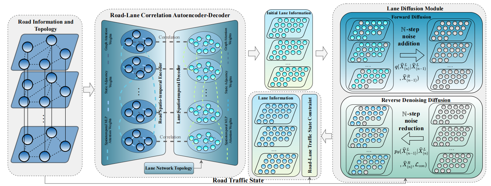

# Fine-Grained Traffic Inference from Road to Lane via Spatio-Temporal Graph Node Generation

This repository contains the PyTorch implementation of the RoadDiff framework, a two-stage model that captures the fine-grained spatiotemporal dependencies between roads and lanes and uses noise reduction diffusion with various traffic state constraints to generate more accurate lane information.

## Necessity:
1. The fine-grained road inference task can significantly reduce the dependence on specialized sensors or high-accuracy object tracking algorithms for downstream tasks that require detailed traffic information, such as lane change guidance and traffic light control.
2. The problem of spatio-temporal graph node generation has important potential research value in fields such as social networks, weather forecasting, and financial analysis.

## Key Design:



1. **Spatio-temporal Modeling:** A simple network structure is used for detailed spatio-temporal modeling. We consider road or lane segments at different times and locations as different nodes and design an attention mechanism across these spatio-temporal nodes.
2. **Lane Diffusion Module:** We design a lane diffusion module to refine the initial lane information, learning the uncertainties and constraints between different traffic states to ensure the accuracy and traffic dependency compliance of the generated fine-grained lane information.

### Requirements:

- Python 3.8
- Matplotlib
- NumPy
- SciPy
- Pandas
- Argparse
- Scikit-learn
- PyTorch==1.11.0

### Datasets:

All datasets should be placed in the `Datasets` directory. If you wish to use your own data, please ensure it is also placed in this directory.

## Run

After confirming that the hyperparameters in the `args.py` file meet your requirements and are correctly set, you can run the RoadDiff framework using the following command:
```bash
python main.py
```